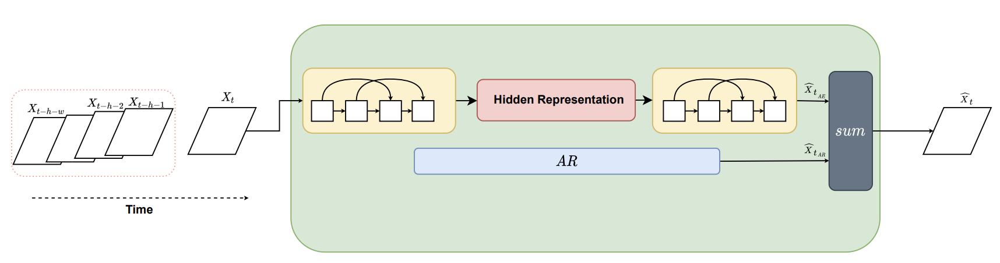
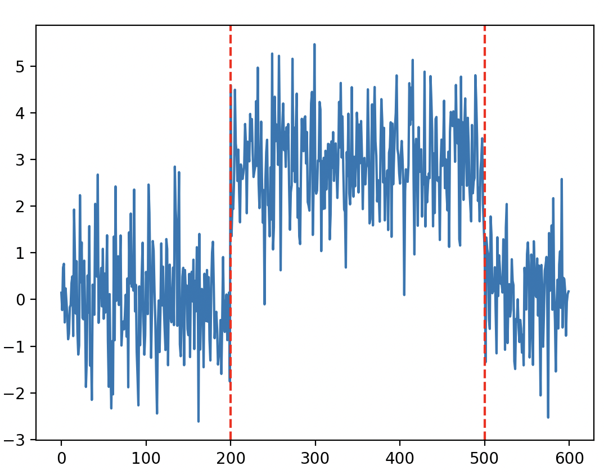

# ALACPD-pytorch
This is a PyTorch implementation of the paper "[Memory-free online change-point detection: A novel neural network approach](https://arxiv.org/abs/2207.03932)". The original implementation is in TensorFlow and can be found [here](https://github.com/zahraatashgahi/ALACPD).

Adaptive Long-Short Term Memory Change Point Detection(ALACPD) is a deep learning-based unsupervised online change-point detection method. It is a highly-parallizable and memory-efficient method that can detect period changes in the data distribution. The method take advantage of a adaptive skip-connected LSTM network and AR model to detect the change-points in the data. 


## Installation
The code has been tested on Python 3.9.19 using the following libraries:

- torch
- numpy
- tqdm (optional; for progress visualization)

To install the required libraries, run:
```bash
pip install -r requirements.txt
```

## Usage
**run.py** is the example script to run the ALACPD model on a synthetic dataset. The script will train the model on the synthetic data and plot the change-point detection results.


Here is an simpler instance of how to use the ALACPD model:
```python
from model.ALACPD import ALACPD

model = ALACPD(input_size, hidden_size, seq_len, res_li)
cpd_points = model.detect(time_series_data)
```